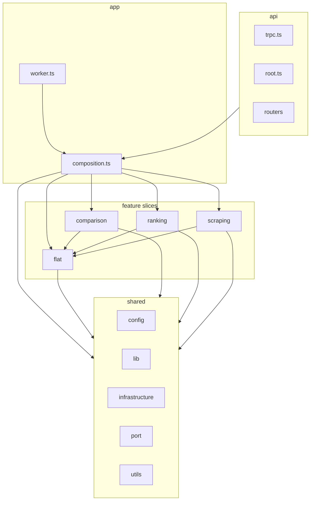
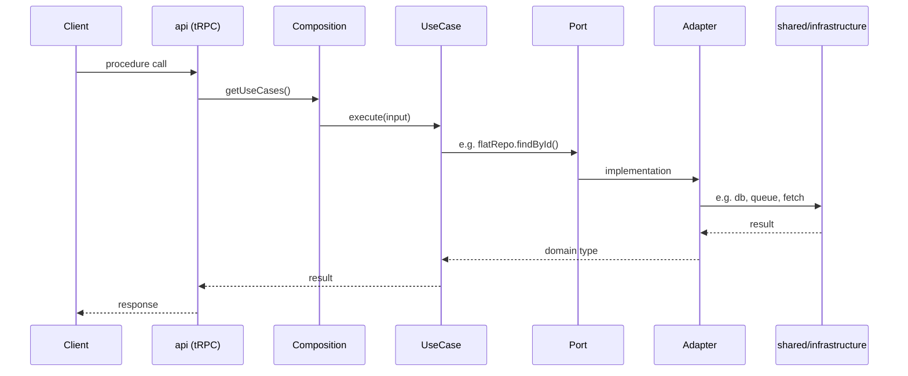
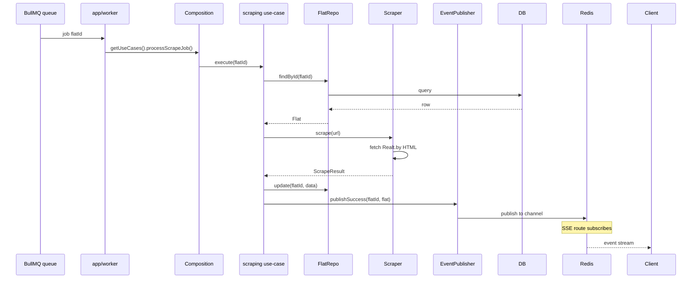

# Apartment Ranker — Architecture

This document describes the server-side architecture, directory layout, and how requests and background jobs flow through the system.

## Overview

The backend follows **Clean Architecture** with a **feature-sliced** layout:

- **Domain and use cases** sit at the centre; they depend only on **ports** (interfaces).
- **Adapters** implement those ports using concrete infrastructure (DB, queue, HTTP, Redis).
- Code is organised by **feature slice** (flat, comparison, ranking, scraping) plus a **shared** layer for cross-cutting config, libs, and infrastructure.
- **App** wires everything (composition root, worker); **api** exposes tRPC and SSE.



## Dependency rule

- **shared** does not depend on any slice.
- **flat** depends only on **shared**.
- **comparison** and **ranking** depend on **flat** and **shared**.
- **scraping** depends on **flat** and **shared**.
- **app** (composition, worker) and **api** depend on all slices and shared.

Dependencies point inward: slices never import from other slices’ internals except via ports/use-cases where intended (e.g. comparison use-cases use flat’s port).

## High-level request flow



## Scrape job flow (background)



## Directory layout

```
src/
  app/                    # Next.js App Router (frontend + API routes)
    _components/
    api/sse/              # SSE endpoint (subscribes to Redis)
    api/trpc/[trpc]/      # tRPC handler
    compare/, rank/, page.tsx, layout.tsx
  server/
    api/                  # tRPC setup and routers
      trpc.ts             # context (useCases), procedures
      root.ts             # appRouter
      routers/            # flat, comparison, rank
    app/                  # Composition and process entrypoints
      composition.ts     # builds adapters, use cases; getUseCases()
      worker.ts          # BullMQ worker (processScrapeJob)
    flat/                 # Flat feature slice
      domain/flat.ts     # Flat, ScrapeStatus
      port/flat.repository.ts
      use-cases/         # add-flat-by-url, remove, list, get, reload
      adapter/drizzle-flat.repository.ts
    comparison/
      domain/comparison.ts
      port/comparison.repository.ts
      use-cases/         # get-comparison-pair, submit-comparison
      adapter/drizzle-comparison.repository.ts
    ranking/
      use-cases/get-ranked-flats.ts
    scraping/
      port/              # scraper, scrape-job.queue, scrape-events
      use-cases/process-scrape-job.ts
      adapter/           # bullmq, realt-scraper, sse-event-publisher
    shared/
      config/bands.ts
      lib/               # band.service, elo.service, scrape-result
      port/scrape-job.queue.ts   # IScrapeJobQueue (used by flat + scraping)
      utils/normalize-realt-url.ts
      infrastructure/
        db/              # Drizzle client, schema (flats, comparisons)
        queue/           # BullMQ + Redis connection
        sse/scrape-events.ts   # Redis pub/sub publish
        scraper/realt.ts # fetch + parse Realt.by listing
```

## Slices and shared (summary)

| Layer    | Role |
|----------|------|
| **shared** | Config (bands), pure lib (Elo, band label, scrape-result types), shared port (scrape queue), utils, and **infrastructure**: DB (Drizzle + SQLite), queue (BullMQ + Redis), SSE publish, Realt scraper. |
| **flat** | Domain (Flat, ScrapeStatus), IFlatRepository, use-cases for add/remove/list/get/reload, Drizzle flat repository adapter. |
| **comparison** | Domain (Comparison), IComparisonRepository, get-comparison-pair and submit-comparison (records comparison + Elo update), Drizzle comparison repository adapter. |
| **ranking** | get-ranked-flats use-case (group by band, order by Elo; depends on flat port + shared band labels). |
| **scraping** | Ports for scraper, queue, events; process-scrape-job use-case; adapters for BullMQ, Realt HTTP, SSE publish. |
| **app** | Composition root (wires all adapters and use-cases), worker (consumes scrape queue, calls processScrapeJob). |
| **api** | tRPC context (exposes useCases), routers (flat, comparison, rank), procedure validation and error mapping. |

## Technology stack

| Concern      | Technology |
|-------------|------------|
| Runtime     | Node.js (Next.js server) |
| API         | tRPC v11, Zod (input validation) |
| DB          | SQLite via LibSQL, Drizzle ORM |
| Queue       | BullMQ, Redis |
| Realtime    | Server-Sent Events (SSE), Redis pub/sub |
| Scraping    | fetch + Cheerio (Realt.by __NEXT_DATA__) |
| Frontend    | Next.js 15 App Router, React 19, Tailwind CSS |

## Environment

- `DATABASE_URL` — Drizzle/LibSQL (e.g. `file:./db.sqlite`).
- `REDIS_URL` — BullMQ and SSE channel (e.g. `redis://localhost:6379`).

See `.env.example` and `src/env.js` for the full schema.

## Conventions

1. **Ports** are interfaces (e.g. `IFlatRepository`); **adapters** implement them and live in each slice’s `adapter/` (or shared when truly cross-cutting).
2. **Use-cases** are plain functions that receive dependencies (repos, queue, etc.) and input; they contain no framework or infra imports.
3. **Domain** types and pure functions live in slice `domain/` or `shared/lib`; no Drizzle, Redis, or fetch in domain.
4. **Composition** is the only place that instantiates adapters and passes them into use-cases; tRPC context and worker get the same use-case container via `getUseCases()`.
